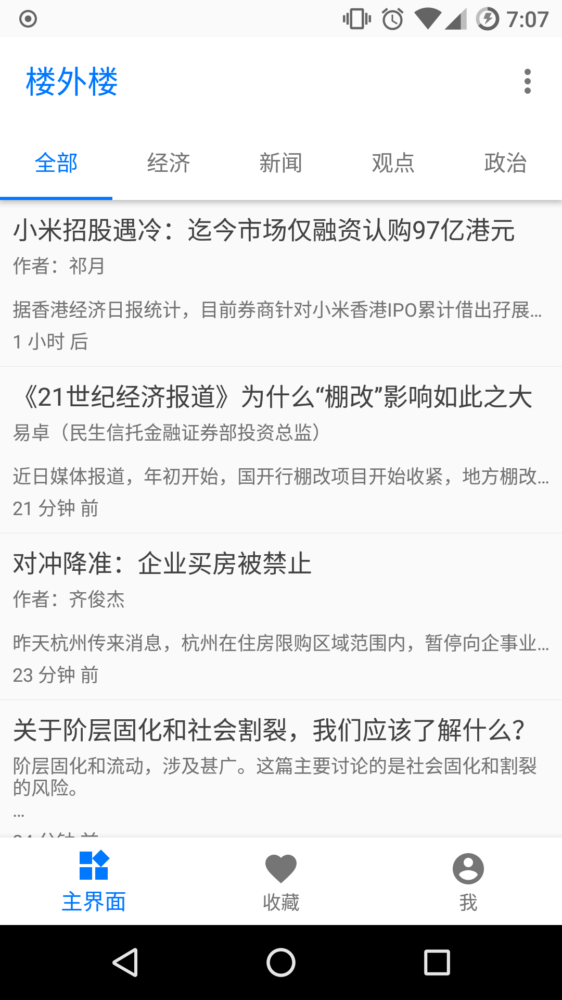
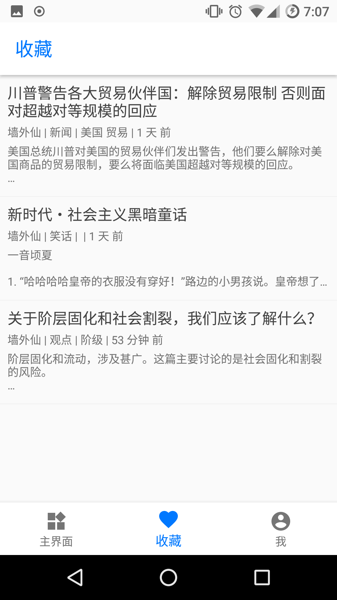
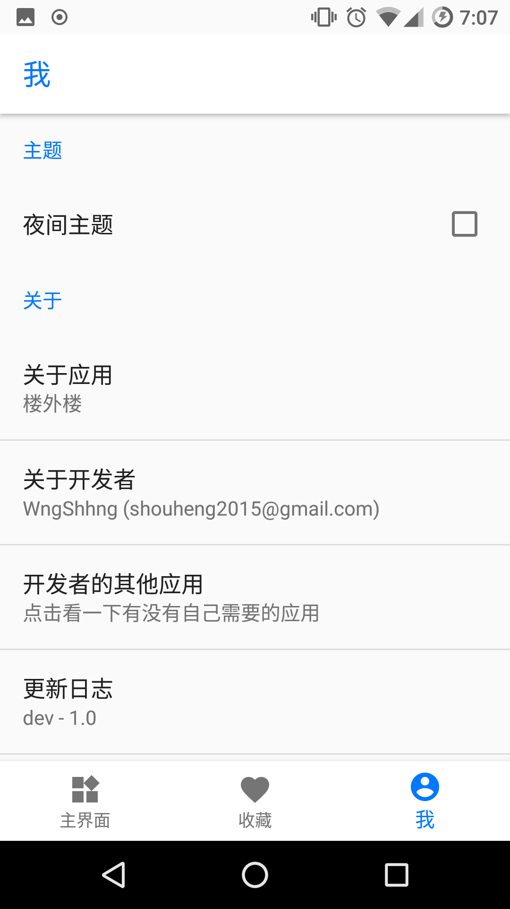
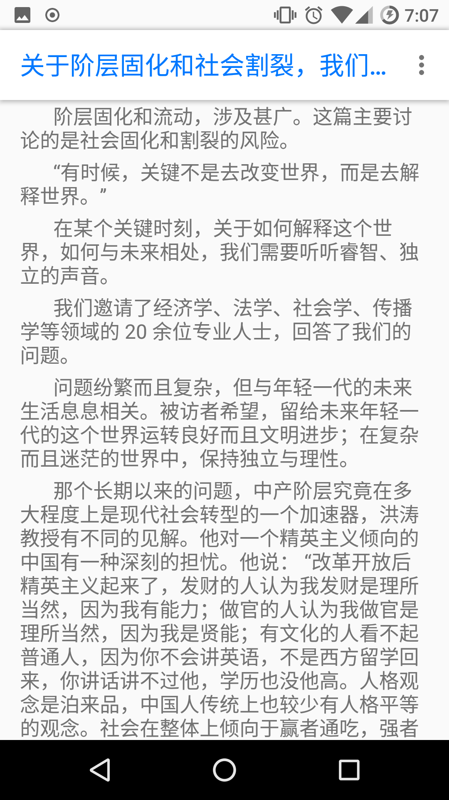
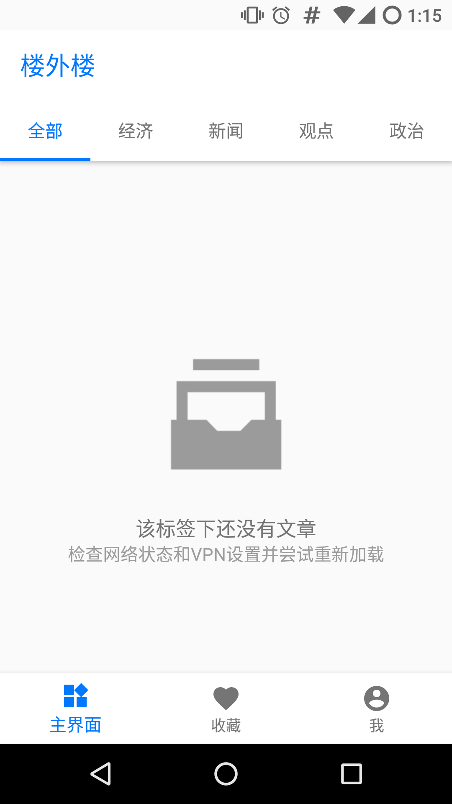
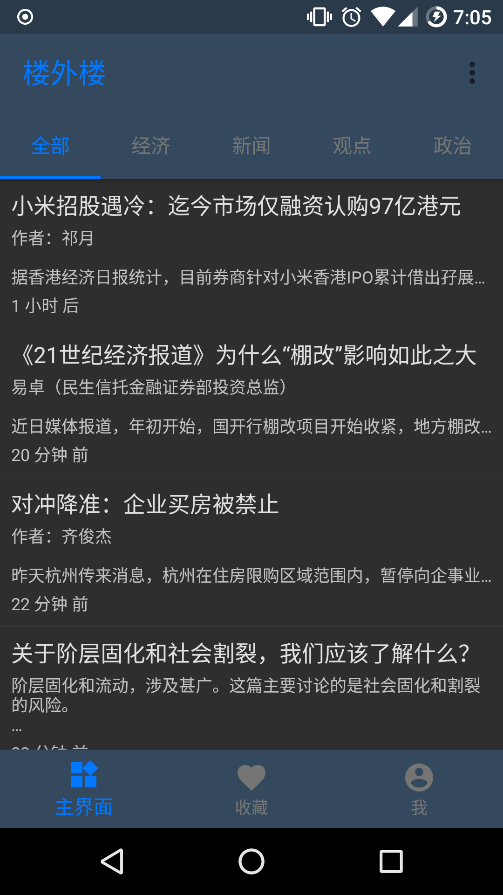
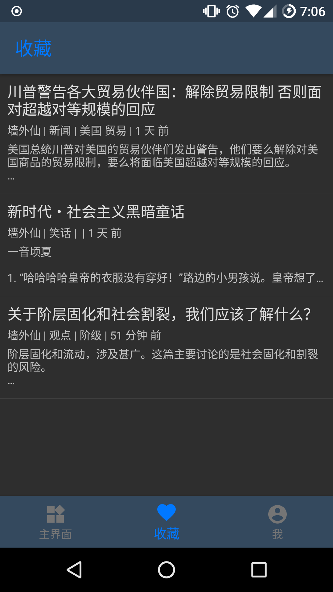
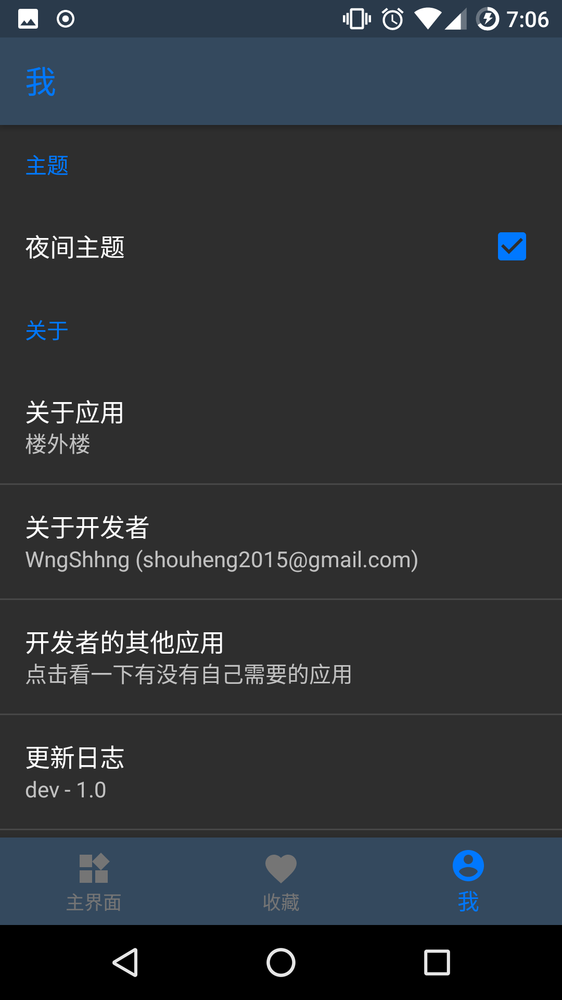
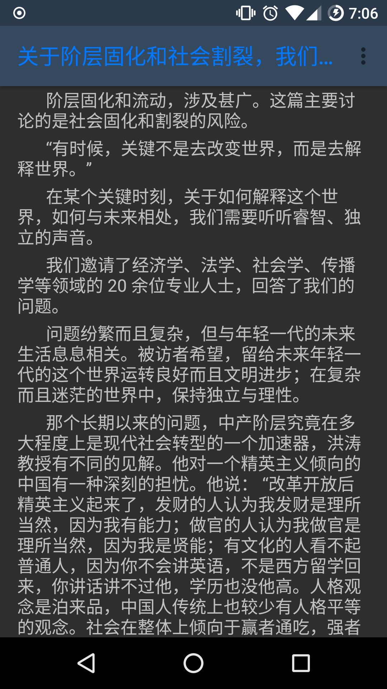

# 楼外楼

> 「楼外楼」是一款基于Material Design的新闻客户端，它的文章取自「墙外楼」，所以该App是「墙外楼」的一个非官方客户端，因为官方的客户端名为「墙外楼」，所以这个非官方的App就名为「楼外楼」。 
> 该项目旨在解决官方客户端使用过程中无法保存和收藏文章的问题，同时优化和提升用户体验，与商业利益没有任何关系。因为文章的内容取自「墙外楼」，所以如果有侵权嫌疑请及时联系开发者删除项目。

## 1、主要功能

- 所有标签及其文章列表
- 提供日/夜两种主题
- 允许用户收藏文章到本地并进行离线阅读
- 允许用户导出文章为txt格式并持久化到磁盘上面
- 允许查看文章的大图并进行放大和缩小

## 2、预览图

### 日间主题

### 夜间主题

## 3、贡献者 Contibutors

Logo & Banner by [debpedrano](https://github.com/debpedrano)
